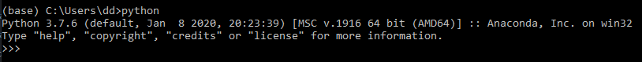

# 1D, 2D and 3D CNNs
> Classify hyperspectral data using different Convolutional Neural Networks (CNNs), which use convolution in the spectral, spatial or in both spectral and spatial domains.

Utilization of convolutional neural networks (CNN) has been growing steeply in many fields, including remote
sensing. At the same time, several textbooks and online learning materials have appeared. What is not so
frequent or missing, are easy-to-use tools enabling practical experimentation with different designs of CNNs.
The presented Classifier Comparison tool, implemented in Python, helps users understand 1D, 2D, and 3D
(spectral, spatial and spectro-spatial) CNN architectures for classification of hyper- or multispectral images,
while presenting a straightforward framework for building more complex networks.

Target audience for our tool are MSc and PhD students, researchers and practitioners from public sector and
industry in fields related to remote sensing and computer vision dealing with CNNs at a beginner level. We
expect only a basic knowledge of CNN fundamentals, Python and Jupyter notebooks.

The presented tool was developed within the ongoing project “E-learning course on Time Series Analysis in
Remote Sensing for Understanding Human-Environment Interactions” (E-TRAINEE, ID 2020-1-CZ01-KA203-
078308) funded by the Erasmus+ Strategic partnership programme. For details see the project homepage:
[https://web.natur.cuni.cz/gis/etrainee/](https://web.natur.cuni.cz/gis/etrainee/)


## Installation

The installation guide is created for Windows. If using MacOS/Linux, most of the process remains the same, except you may need to install GDAL Python API in a different way and it may not be possible use your GPU, given the CUDA toolkit may not be available on your system.
If you already have some experience with Python, you may likely skip to installing external libraries:

- Python installation
- Virtual environment setup (optional)
- Installing GDAL Python API
- Installing PyTorch
- Installing most external libraries
- Running jupyter notebook

### Python installation
Necessary only if you don't have Python 3 already. To try if you have Python 3 installed, open the command line and run either
```sh
python
```
or
```sh
python3
```
If Python 3 is available, it should look similar to this:



If you don't already have a Python 3 installation, we recommend installing miniconda with Python 3.9 from [https://docs.conda.io/en/latest/miniconda.html](https://docs.conda.io/en/latest/miniconda.html).

### Virtual environment setup (optional)
We recommend creating a new Python virtual environment for this project, so your other environments don't become cluttered, which may even lead to conflicts between libraries. While this is not strictly necessary, virtual environments can be created using either [conda](https://docs.conda.io/projects/conda/en/latest/user-guide/tasks/manage-environments.html#creating-an-environment-with-commands) or [venv](https://packaging.python.org/en/latest/guides/installing-using-pip-and-virtual-environments/).

### Installing GDAL Python API
Based on your preferred Python package manager, install GDAL either through

pip - [https://opensourceoptions.com/blog/how-to-install-gdal-for-python-with-pip-on-windows/](https://opensourceoptions.com/blog/how-to-install-gdal-for-python-with-pip-on-windows/)

or

conda - [https://opensourceoptions.com/blog/how-to-install-gdal-with-anaconda/](https://opensourceoptions.com/blog/how-to-install-gdal-with-anaconda/)

### Installing PyTorch
Suitable command for PyTorch installation should be selected on the [PyTorch website](https://pytorch.org/get-started/locally/) based on if your computer has a GPU by Nvidia:
* If you have a Nvidia CUDA-capable GPU then you can install _CUDA toolkit_ and _CuDNN_ from the [Nvidia website](https://developer.nvidia.com/cuda-toolkit), you need to sign up for 'NVIDIA Developer Program' in order to download CuDNN (check the PyTorch website first, so you install an appropriate version of _CUDA_ and _CuDNN_). After successfully installing _CUDA toolkit_ and _CuDNN_, install PyTorch using the command from the [PyTorch website](https://pytorch.org/get-started/locally/). All models were tested with Python 3.9, CUDA version 10.1, CuDNN 7.6 and PyTorch 1.8.1.
* If you do not have a CUDA-capable Nvidia GPU, you can simply use PyTorch on the CPU, by selecting `CPU` in the _Compute Platform_ field on the [PyTorch website](https://pytorch.org/get-started/locally/). All models were tested with Python 3.9 and PyTorch 1.10.2.

### Installing most external libraries
Required Python libraries are:
- matplotlib
- sklearn
- torchnet
- notebook
- tqdm
- ipywidgets
- scipy

Most can be installed only using either

```sh
pip install <library name>
```
or
```sh
conda install <library name>
```

## Usage example

A few motivating and useful examples of how your product can be used. Spice this up with code blocks and potentially more screenshots.

Currently work in progress, sorry for the inconvenience.
