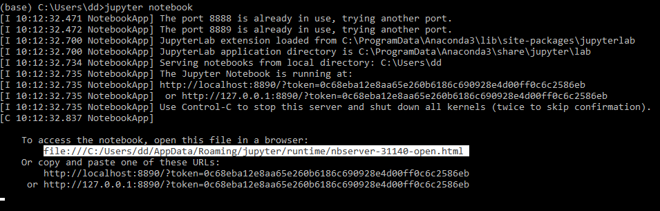

# Instalace a příprava prostředí

V tomto návodu je popsána příprava pro Windows. Pro MacOS/Linux lze postupovat obdobně, pouze...

Celkově lze přípravu rozdělit na několik částí, jestliže už máte nějaké zkušenosti s prací v pythonu, můžete pravděpodobně přeskoči k instalaci PyTorch:

- Instalace Pythonu
- Nastavení virtuálního prostředí (volitelné)
- Instalace PyTorch
- Instalace GDAL API pro Python
- Instalace zbývajících externích knihoven
- Spuštění prostředí Jupyter notebook

## Instalace Pythonu
Nutná pouze pokud již nemáte vhodný Python. Toto lze vyzkoušet otevřením příkazové řadky a spuštěním příkazu
```sh
python
```
nebo
```sh
python3
```
Měl by se spustit Python 3, podobně jako na obrázku: 

Jestliže vhodný Python ještě nemáte, doporučujeme ho nainstalovat skrze balíček miniconda s Python ve verzi 3.9 z webu [https://docs.conda.io/en/latest/miniconda.html](https://docs.conda.io/en/latest/miniconda.html).

## Nastavení virtuálního prostředí (volitelné)
V případě že pracujete na více projektech, doporučujeme vytvořit si pro tento kurz samostatné virtuální prostředí. Zabráníte tím tomu, aby ve vašem prostředí vznikl nepořádek, nebo dokonce konflikt mezi některými knihovnami. Nejde o nutný krok, ovšem v případě potřeby můžete virtuální prostředí jednoduše vytvořit prostřednictvím balíčku [conda](https://docs.conda.io/projects/conda/en/latest/user-guide/tasks/manage-environments.html#creating-an-environment-with-commands) nebo [venv](https://packaging.python.org/en/latest/guides/installing-using-pip-and-virtual-environments/).

## Instalace PyTorch
Vhodný příkaz pro instalaci knihovny PyTorch lze vybrat na [PyTorch webu](https://pytorch.org/get-started/locally/) v závislosti na komponentech Vašeho počítače:

* Jestliže si nejste jistí vlastnostmi svého počítače, případně jestli nemáte grafickou kartu od firmy Nvidia, pak vyberte v poli _Compute Platform_ hodnotu `CPU`.
Například nejnovější verzi Pytorch v době psaní tohoto návodu lze nainstalovat příkazem
```sh
conda install pytorch torchvision torchaudio cpuonly -c pytorch
```

* Jestliže máte grafickou kartu Nvidia kompatibilní s technologií CUDA, pak ji můžete využít pro urychlení běhu neuronových sítí. K tomu je třeba zvolit při zjišťování vhodného příkazu v poli _Compute Platform_ hodnotu `CUDA <verze>`, například nejnovější PyTorch s CUDA ve verzi 11.3 lze nainstalovat příkazem
```sh
conda install pytorch torchvision torchaudio cudatoolkit=11.3 -c pytorch
```

## Installing GDAL API pro Python
V závislosti na Vašem oblíbeném správci balíčků nainstalujte GDAL s pomocí jednoho z těchto návodů:

pip - [https://opensourceoptions.com/blog/how-to-install-gdal-for-python-with-pip-on-windows/](https://opensourceoptions.com/blog/how-to-install-gdal-for-python-with-pip-on-windows/)

nebo

conda - [https://opensourceoptions.com/blog/how-to-install-gdal-with-anaconda/](https://opensourceoptions.com/blog/how-to-install-gdal-with-anaconda/)

## Instalace zbývajících externích knihoven
Pravděpodobně se Vám s předchozími balíčky nenainstalovaly tyto knihovny potřebné pro správné fungování kódu:
- matplotlib
- sklearn
- torchnet
- notebook
- tqdm
- ipywidgets

Všechny prosím nainstalujte jedním z těchto příkazů:

```sh
pip install <název knihovny>
```
nebo
```sh
conda install <název knihovny>
```

## Spuštění prostředí Jupyter notebook
Prostředí juptyter notebook lze opět spustit skrze příkazovou řádku a to příkazem
```sh
jupyter notebook
```

Na některých počítačích se rovnou spustí prohlížeč s běžícím prostředím jupyter notebook, v některých případech je ovšem nutné spustit prohlížeč samostatně a vložit do něj adresu vygenerovanou v příkazové řádce:


Poté v prohlížeči přejdete do složky s uloženými soubory _.ipynb_ a spustíte je.
